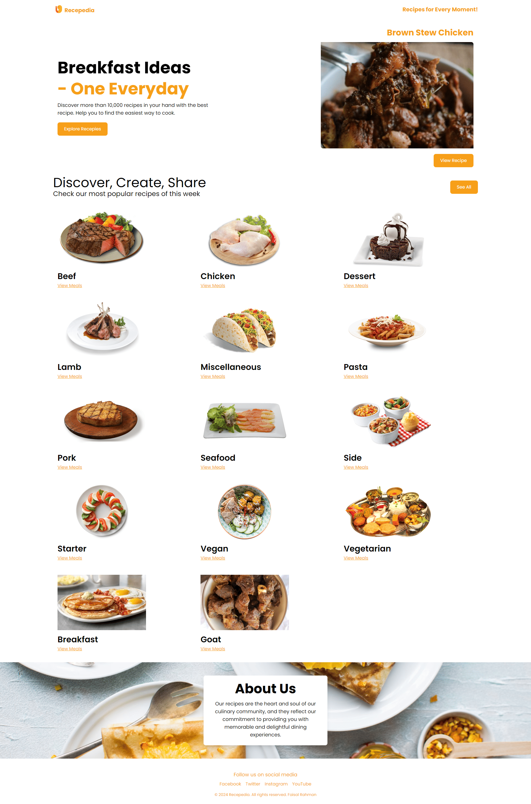

# Recepedia

Recepedia adalah aplikasi web yang dirancang untuk memberikan pengguna koleksi resep lezat untuk setiap momen. Baik Anda mencari makanan cepat saji, makan malam yang istimewa, atau dessert untuk mengesankan, Recepedia siap membantu!

## Fitur

- **Detail Resep**: Lihat informasi mendetail tentang setiap resep, termasuk bahan, instruksi, dan gambar.
- **Desain Responsif**: Antarmuka ramah pengguna yang berfungsi dengan baik di perangkat seluler dan desktop.
- **Integrasi YouTube**: Tonton video tutorial untuk resep tertentu langsung di dalam aplikasi.
- **Pencarian dan Penyaringan**: Temukan resep dengan mudah berdasarkan preferensi dan kebutuhan diet Anda.

## Teknologi yang Digunakan

- HTML
- CSS (Tailwind CSS)
- JavaScript
- Axios untuk panggilan API
- [TheMealDB API](https://www.themealdb.com/) untuk mengambil data resep

## Instalasi

1. Clone repositori:

   ```bash
   git clone https://github.com/username-anda/recepedia.git
   cd recepedia
   ```

2. Buka index.html di browser Anda untuk melihat aplikasi.

## Penggunaan

- Buka `index.html` di browser Anda untuk melihat aplikasi.
- Navigasikan melalui resep yang tersedia di halaman utama.
- Klik pada sebuah resep untuk melihat detailnya, termasuk bahan dan instruksi memasak.
- Jika tersedia, tonton tutorial YouTube untuk panduan langkah demi langkah.

## Screenshot

Berikut adalah tampilan dari aplikasi:



## Kontribusi

Kontribusi sangat diterima! Jika Anda memiliki saran untuk perbaikan atau fitur baru, silakan buat masalah atau kirim permintaan tarik.
